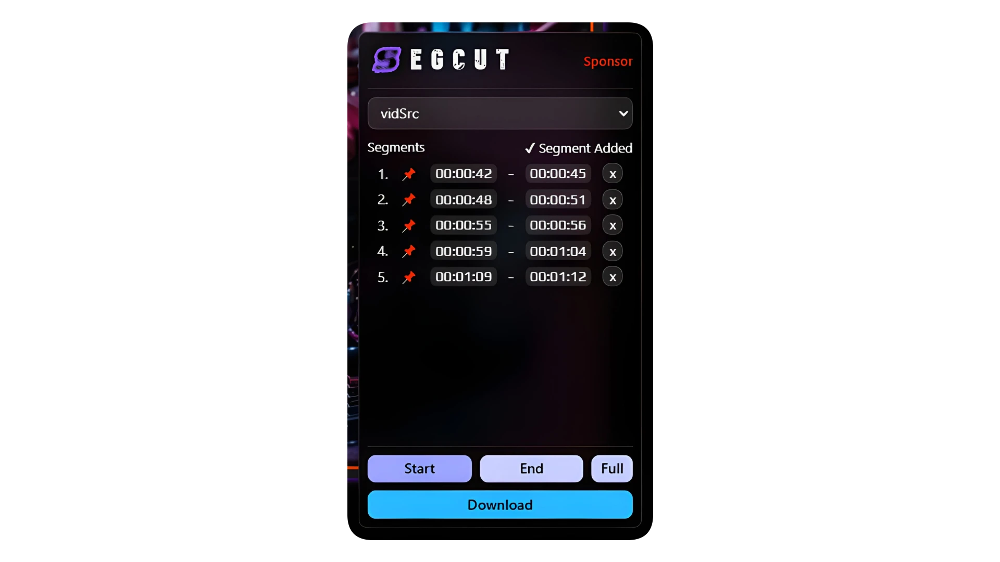

<p align="center">
    
</p>

<p align="center">
    <strong>SegCut</strong> is a fast browser-based tool that lets you cut and download specific segments from online videos — without downloading the entire file manually.
</p>

#### Installation
- Windows
```bash
powershell -ExecutionPolicy Bypass -Command "irm https://raw.githubusercontent.com/madhanmaaz/SegCut/refs/heads/main/scripts/install.ps1 -OutFile $env:TEMP\segcut.ps1; & $env:TEMP\segcut.ps1 --install"
```

- Linux & MacOs
```bash
curl -fsSL https://raw.githubusercontent.com/madhanmaaz/SegCut/refs/heads/main/scripts/install.sh | bash -s -- --install
```

#### Update
- Windows: Open `SegCut Updater` from the Start Menu
- Linux & macOS 
```bash
segcut --update
```

#### Uninstall
- Windows: Open `SegCut Uninstaller` from the Start Menu
- Linux & macOS 
```bash
segcut --uninstall
```

#### Manual Installation

#### Prerequisites
Before installing SegCut, make sure you have the following installed:
- [Node.js](https://nodejs.org/)
    - Verify installation: `node -v` and `npm -v`

- [FFmpeg](https://ffmpeg.org/download.html)
    - Make sure FFmpeg is added to your system PATH.
    - Verify installation: `ffmpeg -version`

#### Clone
```bash
git clone https://github.com/madhanmaaz/segcut.git
cd segcut
npm install
```

#### Load Chrome Extension
1. Open **Browser**
2. Navigate to `chrome://extensions/`
3. Enable **Developer mode** (top-right corner)
4. Click **Load unpacked**
5. Select the `extension/` folder from the project directory
6. Pin **SegCut**
7. Click the **SegCut icon** to activate it on a webpage

#### Screenshot

<p align="center">
    
</p>
